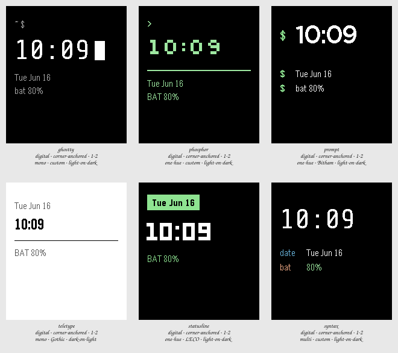

# Session 2026-07-24-terminal-spread — Batch 1

## Findings

Only failures and flags appear here. A Variant with nothing against it measured clean.

### ghostty

`digital · corner-anchored · 1-2 · mono · custom · light-on-dark`

- **glance hierarchy** — tallest element is only 1.00x the next, so there is no clear primary _(at the canonical state)_

Reads exactly as intended: the restraint survives the shrink, and the block cursor does all the work of saying terminal without costing a single field of information. The most likely of the six to still look right in a year, because there is nothing in it to date. Its risk is the opposite of clutter — take one more thing away and it is white text on black.

### phosphor

`digital · corner-anchored · 1-2 · one-hue · custom · light-on-dark`

- **glance hierarchy** — tallest element is only 1.00x the next, so there is no clear primary _(at the canonical state)_

The most immediately terminal of the six and also the most costume-like; Silkscreen is doing an impression of a CRT rather than being one. Its real weakness is that the pixel face reads smaller and lighter than everything else in the Batch at the same nominal size, making it the worst glance-read of the three dark custom-type tiles. Charming on a contact sheet, tiring on a wrist.

### prompt

`digital · corner-anchored · 1-2 · one-hue · Bitham · light-on-dark`

Nothing measured against it.

The surprise of the Batch. It buys the terminal read entirely with structure — a sigil column and output aligned behind it — and gets a larger, clearer time than either custom-face pole, because Bitham is simply better proportioned at this size than the bundled faces. If the answer turns out to be neither Ghostty nor mainframe but just a shell, this is already it, and it costs no resources.

### teletype

`digital · corner-anchored · 1-2 · mono · Gothic · dark-on-light`

Nothing measured against it.

Included to put the sunlight-legibility argument on the sheet, and it loses on its own terms: Gothic's 28px ceiling leaves the time barely taller than its own labels, so there is no primary at a glance even though the measurement passes. The dark-on-light question is real and worth coming back to on a reflective display. This typeface cannot carry it.

### statusline

`digital · corner-anchored · 1-2 · one-hue · LECO · light-on-dark`

- **glance hierarchy** — tallest element is only 1.12x the next, so there is no clear primary _(at the canonical state)_

The inverse-video field is the best single device in the Batch — it says machine more economically than any amount of green does. But it currently competes with the time rather than supporting it, and LECO's geometric numerals are the least terminal-like thing on the sheet. The idea is worth keeping; the face under it is not.

### syntax

`digital · corner-anchored · 1-2 · multi · custom · light-on-dark`

- **glance hierarchy** — tallest element is only 1.00x the next, so there is no clear primary _(at the canonical state)_

Answers its own question: the colour is doing real work, since you know which field you are reading without reading the label, and it stays well inside what the brief called clutter. Whether it is right depends on whether you want a terminal at rest or a terminal mid-output — it is the only tile that chooses the second, which is either the whole point or a step too far.
