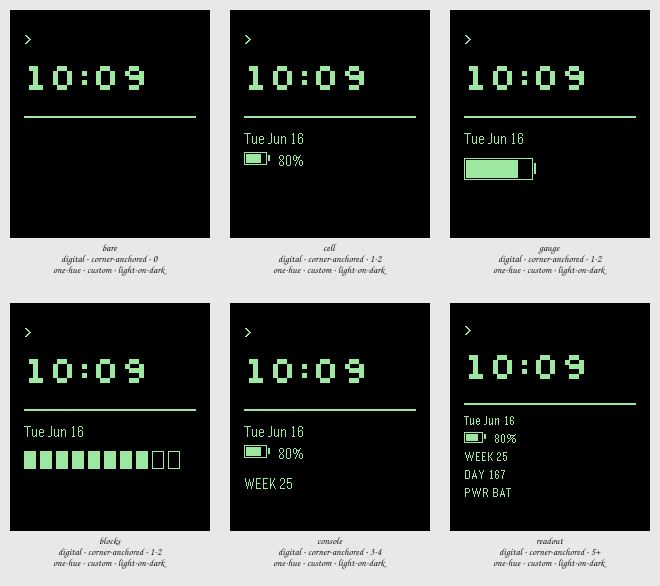

# Session 2026-07-24-terminal-spread — Batch 2

## Findings

Only failures and flags appear here. A Variant with nothing against it measured clean.

### bare

`digital · corner-anchored · 0 · one-hue · custom · light-on-dark`

- **glance hierarchy** — tallest element is only 1.00x the next, so there is no clear primary _(at the canonical state)_

The zero endpoint, and it earns its place by proving the caret and the rule carry the terminal read entirely on their own. But a face showing nothing but the hour is a screensaver, and next to it every other tile looks justified rather than cluttered.

### cell

`digital · corner-anchored · 1-2 · one-hue · custom · light-on-dark`

- **glance hierarchy** — tallest element is only 1.00x the next, so there is no clear primary _(at the canonical state)_

The direct answer to the brief: the cell icon reads as a battery instantly and the percentage beside it does everything the word BAT was doing in Batch 1, in less width and with less noise. It is the only tile where the complication looks like part of the design rather than an addition to it. The strongest of the six.

### gauge

`digital · corner-anchored · 1-2 · one-hue · custom · light-on-dark`

- **glance hierarchy** — tallest element is only 1.00x the next, so there is no clear primary _(at the canonical state)_

Dropping the number and enlarging the cell is the boldest move here, and at that size the fill level is legible without focusing. The cost is that it trades a precise reading for an approximate one and pulls enough weight to compete with the time — a battery should not be the second thing you see.

### blocks

`digital · corner-anchored · 1-2 · one-hue · custom · light-on-dark`

- **glance hierarchy** — tallest element is only 1.00x the next, so there is no clear primary _(at the canonical state)_

The most literally TTY thing on the sheet and the most decorative, which is the problem: ten discrete cells read as a progress bar, and a progress bar implies something is filling rather than draining. It also spends the full column width to say less than the icon says in a quarter of it.

### console

`digital · corner-anchored · 3-4 · one-hue · custom · light-on-dark`

- **glance hierarchy** — tallest element is only 1.00x the next, so there is no clear primary _(at the canonical state)_

WEEK 25 is the fairest possible test of one field too many, and it fails politely — nothing is crowded, the rhythm still works, and nothing whatsoever was gained. Keep it as the evidence that the brief's ceiling is real rather than cautious.

### readout

`digital · corner-anchored · 5+ · one-hue · custom · light-on-dark`

- **glance hierarchy** — tallest element is only 1.00x the next, so there is no clear primary _(at the canonical state)_

The mainframe dump, and the only tile that looks busy at a glance. Every field is legitimately clock- or battery-derived and not one of them is wanted, which makes the case for the brief more convincingly than any argument for it could.
