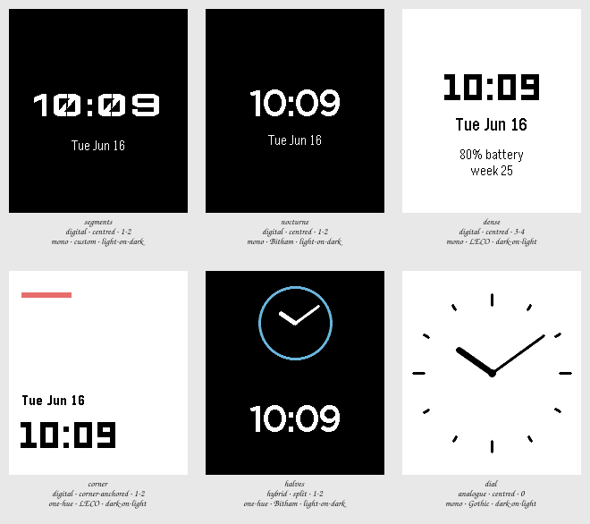

# Session 2026-07-24-type-and-polarity — Batch 1

## Findings

Only failures and flags appear here. A Variant with nothing against it measured clean.

**Not viable as they stand:** `corner`.

### segments

`digital · centred · 1-2 · mono · custom · light-on-dark`

Nothing measured against it.

Reads as a machine readout rather than a watch, which is either exactly the brief or exactly wrong for it. The LCD face carries all of the character — strip it back to Bitham and this is nocturne. Worth keeping only if the mechanical register is what was wanted.

### nocturne

`digital · centred · 1-2 · mono · Bitham · light-on-dark`

Nothing measured against it.

The most restrained of the six and the easiest to read at a glance. Inverting the ground earns its place here rather than being decoration: it is the only thing distinguishing it from plain. Least likely to feel dated in a month.

### dense

`digital · centred · 3-4 · mono · LECO · dark-on-light`

Nothing measured against it.

Carries the most and pays for it — the eye lands on the time, then has to work out the order of everything else. The week number is filler; nobody has ever needed it on a wrist.

### corner

`digital · corner-anchored · 1-2 · one-hue · LECO · dark-on-light`

- **contrast** — complication element at 3.1:1 against its ground, below the 4.5:1 floor _(at the stress state)_

The one genuine composition idea in the Batch, and the accent rule gives it a point of view. But the rule measures 3.1:1 against white, so the one flourish it has is also its only measured failure.

### halves

`hybrid · split · 1-2 · one-hue · Bitham · light-on-dark`

Nothing measured against it.

Showing the time twice reads as indecisive rather than considered, and the dial is too small to be read as a dial. The blue ring is doing more work than the design underneath it.

### dial

`analogue · centred · 0 · mono · Gothic · dark-on-light`

Nothing measured against it.

The only one that is not a screen full of numerals, and it benefits from the comparison. At 10:09 it is open and legible; at the Stress state the hands collapse into a single stroke, which is a real weakness of hands rather than of this drawing.

## Pick

**nocturne**

Most restrained, easiest to read, and its one idea — the inverted ground — is a legibility decision rather than a decorative one.

Session closed.
