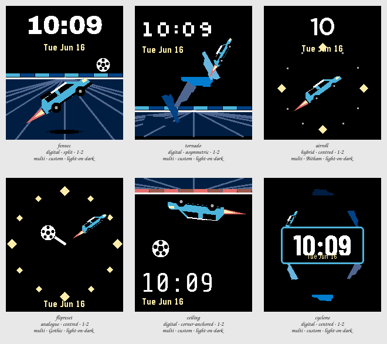

# Session 2026-07-25-fennec-aerial — Batch 1

## Findings

Only failures and flags appear here. A Variant with nothing against it measured clean.

**Not viable as they stand:** `fennec`, `tornado`, `ceiling`, `cyclone`.

### fennec

`digital · split · 1-2 · multi · custom · light-on-dark`

- **contrast** — time element at 1.3:1 against its ground, below the 7.0:1 floor _(at the stress state)_
- **clipping** — something is drawn on the outermost row or column, so it is cut off _(at the stress state)_
- **ink coverage** — 52% of pixels are inked, a dense design _(at the canonical state)_
- **safe margin** — nearest element is 0 px from the display edge, below 8 px _(at the canonical state)_

### tornado

`digital · asymmetric · 1-2 · multi · custom · light-on-dark`

- **contrast** — time element at 1.3:1 against its ground, below the 7.0:1 floor _(at the stress state)_
- **clipping** — something is drawn on the outermost row or column, so it is cut off _(at the stress state)_
- **safe margin** — nearest element is 0 px from the display edge, below 8 px _(at the canonical state)_

### airroll

`hybrid · centred · 1-2 · multi · Bitham · light-on-dark`

Nothing measured against it.

### flipreset

`analogue · centred · 1-2 · multi · Gothic · light-on-dark`

- **glance hierarchy** — tallest element is only 1.14x the next, so there is no clear primary _(at the canonical state)_
- **safe margin** — nearest element is 1 px from the display edge, below 8 px _(at the canonical state)_

### ceiling

`digital · corner-anchored · 1-2 · multi · custom · light-on-dark`

- **contrast** — complication element at 1.3:1 against its ground, below the 4.5:1 floor _(at the stress state)_
- **clipping** — something is drawn on the outermost row or column, so it is cut off _(at the stress state)_
- **glance hierarchy** — tallest element is only 1.09x the next, so there is no clear primary _(at the canonical state)_
- **safe margin** — nearest element is 0 px from the display edge, below 8 px _(at the canonical state)_

### cyclone

`digital · centred · 1-2 · multi · custom · light-on-dark`

- **contrast** — complication element at 1.3:1 against its ground, below the 4.5:1 floor _(at the stress state)_
