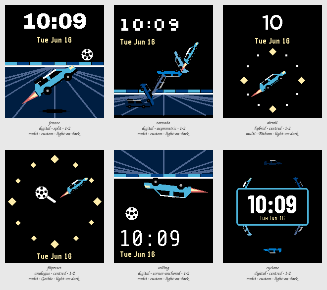

# Session 2026-07-25-fennec-aerial — Batch 2

## Findings

Only failures and flags appear here. A Variant with nothing against it measured clean.

**Not viable as they stand:** `fennec`, `tornado`, `ceiling`, `cyclone`.

### fennec

`digital · split · 1-2 · multi · custom · light-on-dark`

- **contrast** — time element at 1.3:1 against its ground, below the 7.0:1 floor _(at the stress state)_
- **clipping** — something is drawn on the outermost row or column, so it is cut off _(at the stress state)_
- **ink coverage** — 52% of pixels are inked, a dense design _(at the canonical state)_
- **safe margin** — nearest element is 0 px from the display edge, below 8 px _(at the canonical state)_

The swap was right: the Fennec's flat roof and upright screen survive being rotated in a way the Octane's wedge never did, and this tile exists only to prove that before the rest of the Batch spends it. As a design it is the plainest thing here — one car, one angle, type in its own half — and it is the only aerial in the Batch that could be mistaken for a photograph of a parked car if the shadow were removed. Keep it as the control, not as the candidate.

### tornado

`digital · asymmetric · 1-2 · multi · custom · light-on-dark`

- **contrast** — time element at 1.3:1 against its ground, below the 7.0:1 floor _(at the stress state)_
- **clipping** — something is drawn on the outermost row or column, so it is cut off _(at the stress state)_
- **safe margin** — nearest element is 0 px from the display edge, below 8 px _(at the canonical state)_

The spin reads, and it only reads because the copies kept their glazing and wheels — as flat silhouettes they were debris, and the difference is worth knowing before anyone tries this again cheaply. It is the busiest tile in the Batch and the trail eats three quarters of the display to say one thing, which is a lot of display for a decoration that never moves. The diagonal does earn the top-left corner for the type, so nothing is ever read across a car.

### airroll

`hybrid · centred · 1-2 · multi · Bitham · light-on-dark`

Nothing measured against it.

The only tile in the Batch where the spin is information rather than an illustration of one, and the only one that measured completely clean. It is a real hybrid: the hour is a numeral, the minute is genuinely an angle, and a car air-rolling once an hour is a mechanism nobody else's watchface has. The cost is precision — with twelve marks the nose gets you to the nearest five minutes and no closer, so this is a face for people who do not need the exact minute.

### flipreset

`analogue · centred · 1-2 · multi · Gothic · light-on-dark`

- **safe margin** — nearest element is 5 px from the display edge, below 8 px _(at the canonical state)_

Disqualified at the Stress state, and by the failure this Session set out to avoid: at 23:58 the car and the ball land on the same bearing, the ball sits in the middle of the car, and the face says nothing at all. Putting them at different radii was the fix and it was not enough, because the car is long and its tail reaches back over the hour. The dial of boost pads is the best-looking object in the Batch and it is attached to the one Variant here that cannot tell the time.

### ceiling

`digital · corner-anchored · 1-2 · multi · custom · light-on-dark`

- **contrast** — time element at 1.3:1 against its ground, below the 7.0:1 floor _(at the stress state)_
- **clipping** — something is drawn on the outermost row or column, so it is cut off _(at the stress state)_
- **safe margin** — nearest element is 0 px from the display edge, below 8 px _(at the canonical state)_

The calmest layout in the Batch and the only one that leaves the type a corner rather than a band, which turns out to be enough room — the time is larger here than in fennec and fights nothing. Inverting the frame is also the cheapest idea here: this is fennec upside down, and the ceiling reads as a ceiling only because the car is hanging from it. Worth keeping for the layout rather than for the trick.

### cyclone

`digital · centred · 1-2 · multi · custom · light-on-dark`

- **contrast** — complication element at 1.3:1 against its ground, below the 4.5:1 floor _(at the stress state)_
- **contrast** — complication element at 2.8:1 against its ground, below the 4.5:1 floor _(at the stress state)_
- **contrast** — complication element at 2.8:1 against its ground, below the 4.5:1 floor _(at the stress state)_
- **contrast** — complication element at 2.8:1 against its ground, below the 4.5:1 floor _(at the stress state)_
- **contrast** — complication element at 2.8:1 against its ground, below the 4.5:1 floor _(at the stress state)_

The plate is the tell. Six cars orbiting the numerals is a good picture, but the numerals need a hard black box to survive it, and once that box is drawn the two cars at the sides are behind it and the orbit is really four cars and a rectangle. Its measured contrast failures are the ghost copies against black, not the date — but they say the same thing the picture does, that the dimmest end of the trail is nearly invisible and the spin is doing less work than it costs.
