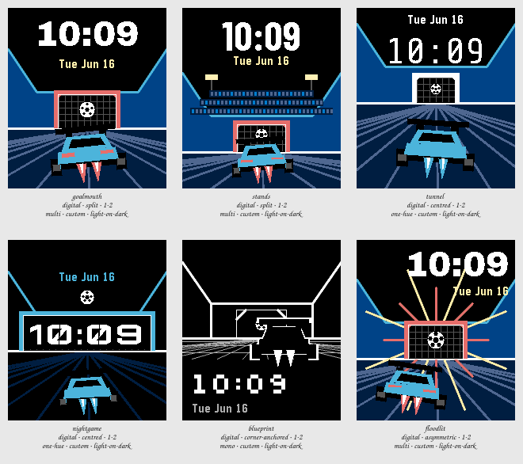

# Session 2026-07-25-fennec-aerial — Batch 3

## Findings

Only failures and flags appear here. A Variant with nothing against it measured clean.

**Not viable as they stand:** `goalmouth`, `stands`, `tunnel`, `nightgame`, `blueprint`, `floodlit`.

### goalmouth

`digital · split · 1-2 · multi · custom · light-on-dark`

- **contrast** — time element at 1.3:1 against its ground, below the 7.0:1 floor _(at the stress state)_
- **clipping** — something is drawn on the outermost row or column, so it is cut off _(at the stress state)_
- **ink coverage** — 56% of pixels are inked, a dense design _(at the canonical state)_
- **safe margin** — nearest element is 0 px from the display edge, below 8 px _(at the canonical state)_

The vantage change alone does most of the work: side walls falling away and a floor of lines converging on a goal give the eye somewhere to go, which a side view never had. Keeping fennec's exact split means the type is unaffected and the comparison is honest. It is also the plainest of the six now that the background is doing something, which makes it the one to beat rather than the one to pick.

### stands

`digital · split · 1-2 · multi · custom · light-on-dark`

- **contrast** — time element at 1.3:1 against its ground, below the 7.0:1 floor _(at the stress state)_
- **clipping** — something is drawn on the outermost row or column, so it is cut off _(at the stress state)_
- **ink coverage** — 54% of pixels are inked, a dense design _(at the canonical state)_
- **safe margin** — nearest element is 0 px from the display edge, below 8 px _(at the canonical state)_

Terraces and floodlights are the right instinct and the wrong amount. The crowd reads as a band of blue noise at this size, the floodlights as two yellow ticks, and dropping the horizon to fit them leaves the car almost no floor to be above — the tile is busier than goalmouth and says less. If a stadium is wanted, it wants the terraces only on the far wall and nothing on the skyline.

### tunnel

`digital · centred · 1-2 · one-hue · custom · light-on-dark`

- **contrast** — time element at 1.3:1 against its ground, below the 7.0:1 floor _(at the stress state)_
- **clipping** — something is drawn on the outermost row or column, so it is cut off _(at the stress state)_
- **ink coverage** — 69% of pixels are inked, a dense design _(at the canonical state)_
- **safe margin** — nearest element is 0 px from the display edge, below 8 px _(at the canonical state)_

The most convincing scene in the Batch and the densest thing here at 69% ink. Pushing the horizon up and the walls out turns the arena into a funnel that genuinely reads as depth, and restricting to one hue is what keeps it one shape rather than three. Its problem is the top: with the walls climbing to the corners the type has bright blue on both sides of it, and that is the one place in this layout the numerals cannot afford company.

### nightgame

`digital · centred · 1-2 · one-hue · custom · light-on-dark`

- **contrast** — time element at 1.3:1 against its ground, below the 7.0:1 floor _(at the stress state)_
- **clipping** — something is drawn on the outermost row or column, so it is cut off _(at the stress state)_
- **safe margin** — nearest element is 0 px from the display edge, below 8 px _(at the canonical state)_

The opposite answer, and the more useful one — turn the arena off, leave the goal lit, and the time gets flat black to sit on. It measured cleanest of the coloured tiles and it is the only one where nothing at all competes with the numerals. Two things had to be fixed to get there and both are findings: a segment face cannot sit on a net, and the goal had to be drawn wide rather than small, which throws away the depth cue goalmouth gets from a small goal and a big car.

### blueprint

`digital · corner-anchored · 1-2 · mono · custom · light-on-dark`

- **clipping** — something is drawn on the outermost row or column, so it is cut off _(at the stress state)_
- **safe margin** — nearest element is 0 px from the display edge, below 8 px _(at the canonical state)_

The Batch's control, and it very nearly wins. With no fills at all the convergence still reads, the goal still reads, and the car in keyline still reads — so most of what the other five spend on walls and crowds is spent on decoration. It only works because the lattice stops short of the numerals; run the floor under them and the type is unreadable, which is the tile's real lesson. Least Rocket League of the six by a mile.

### floodlit

`digital · asymmetric · 1-2 · multi · custom · light-on-dark`

- **contrast** — time element at 1.3:1 against its ground, below the 7.0:1 floor _(at the stress state)_
- **clipping** — something is drawn on the outermost row or column, so it is cut off _(at the stress state)_
- **ink coverage** — 59% of pixels are inked, a dense design _(at the canonical state)_
- **safe margin** — nearest element is 0 px from the display edge, below 8 px _(at the canonical state)_

The only tile where the background is an event rather than a place, and the rays do read as a net going off. It is also the only one that puts a busy ground nowhere near the type — the burst sits low centre, the time is up in a black corner — so the obvious risk did not materialise. The cost is that it is permanently mid-celebration, which is a strange thing to wear at four in the afternoon, and the off-centre car fights the burst for the eye rather than balancing it.
