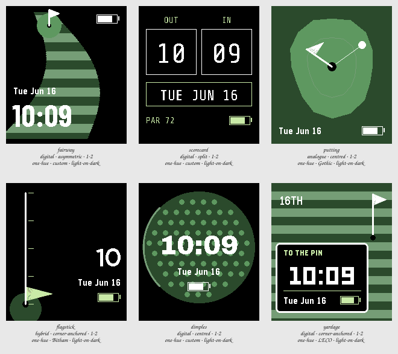

# Session 2026-07-25-golf — Batch 1

## Findings

Only failures and flags appear here. A Variant with nothing against it measured clean.

**Not viable as they stand:** `fairway`, `putting`, `flagstick`, `dimples`, `yardage`.

### fairway

`digital · asymmetric · 1-2 · one-hue · custom · light-on-dark`

- **contrast** — time element at 2.1:1 against its ground, below the 7.0:1 floor _(at the stress state)_
- **clipping** — something is drawn on the outermost row or column, so it is cut off _(at the stress state)_
- **ink coverage** — 43% of pixels are inked, a dense design _(at the canonical state)_
- **safe margin** — nearest element is 0 px from the display edge, below 8 px _(at the canonical state)_

The most golf of the six and the least clean: the mowing stripes run straight through the numerals, and at the Stress state the wider digits sit on the fairway from end to end, so the time is read across four tonal changes. The asymmetric mass is genuinely good — the eye lands bottom-left because the hole leads it there — but this direction only survives if the stripes stop where the type starts. The measured contrast failure is the turf against the rough, not the type; the real number is white on a light stripe, and that one is a fifth of what the floor asks.

### scorecard

`digital · split · 1-2 · one-hue · custom · light-on-dark`

Nothing measured against it.

The only Variant that measured clean, and the only one whose theme costs it nothing — a ruled card is already a legible grid, so nothing had to be traded to get it. The risk is real and visible on the sheet: with the hour and minute boxed apart and no colon between them, the first read is a score rather than a time, and OUT/IN is a wink only a golfer catches. Cleanest thing here by a distance, and the most likely to stop reading as golf after a week.

### putting

`analogue · centred · 1-2 · one-hue · Gothic · light-on-dark`

- **contrast** — time element at 2.9:1 against its ground, below the 7.0:1 floor _(at the stress state)_
- **ink coverage** — 41% of pixels are inked, a dense design _(at the canonical state)_

The best idea in the Batch and the worst execution of it. A pin for the hour and a ball rolling round for the minute is exactly the wild reading the brief asked for, but white hands on the green surface are nowhere near the floor for something that IS the time, and giving up the ring of hour markers leaves nothing to read the pin against. At the Stress state both hands collapse onto the same bearing and the face says nothing at all — that is the disqualifying one, and it is a geometry problem, not a colour problem.

### flagstick

`hybrid · corner-anchored · 1-2 · one-hue · Bitham · light-on-dark`

- **contrast** — time element at 2.1:1 against its ground, below the 7.0:1 floor _(at the stress state)_
- **clipping** — something is drawn on the outermost row or column, so it is cut off _(at the stress state)_
- **safe margin** — nearest element is 0 px from the display edge, below 8 px _(at the canonical state)_

The pennant climbing the pole is a lovely object and a poor clock: nothing on the sheet tells you whether that flag is at :55 or :58, and the quarter ticks are too sparse to close the gap. It is also the least dense and the calmest layout here, which the brief did ask for. Worth keeping as evidence that the hybrid position is charming, and not worth keeping as a way to read minutes.

### dimples

`digital · centred · 1-2 · one-hue · custom · light-on-dark`

- **contrast** — time element at 2.1:1 against its ground, below the 7.0:1 floor _(at the stress state)_
- **clipping** — something is drawn on the outermost row or column, so it is cut off _(at the stress state)_
- **ink coverage** — 56% of pixels are inked, a dense design _(at the canonical state)_
- **safe margin** — nearest element is 0 px from the display edge, below 8 px _(at the canonical state)_

Restraint pays: one object, an ordinary centred stack, and the dimple lattice alone carries the theme — this is the only Variant that would pass for a normal watchface at arm's length and still be unmistakably golf. Its own comment names the problem the sheet confirms, that a green golf ball is not a golf ball, and the dimples immediately behind the numerals cost more legibility than the ball's silhouette is worth. Almost right; the fix is a polarity Sweep and a cleared centre, not a redesign.

### yardage

`digital · corner-anchored · 1-2 · one-hue · LECO · light-on-dark`

- **contrast** — time element at 2.1:1 against its ground, below the 7.0:1 floor _(at the stress state)_
- **contrast** — complication element at 3.2:1 against its ground, below the 4.5:1 floor _(at the stress state)_
- **clipping** — something is drawn on the outermost row or column, so it is cut off _(at the stress state)_
- **ink coverage** — 69% of pixels are inked, a dense design _(at the canonical state)_
- **safe margin** — nearest element is 0 px from the display edge, below 8 px _(at the canonical state)_

Takes the theme from golf's signage rather than its scenery, and that is why it works: the plate hands the numerals a hard black rectangle, so the turf can be as loud as it likes without touching the time. It is the most conservative entry and reads that way — a dark panel on a green field is a solved layout, borrowed rather than found. Every measured failure against it is the full-bleed turf, not the face; treat it as the thing the wilder Variants have to beat.
