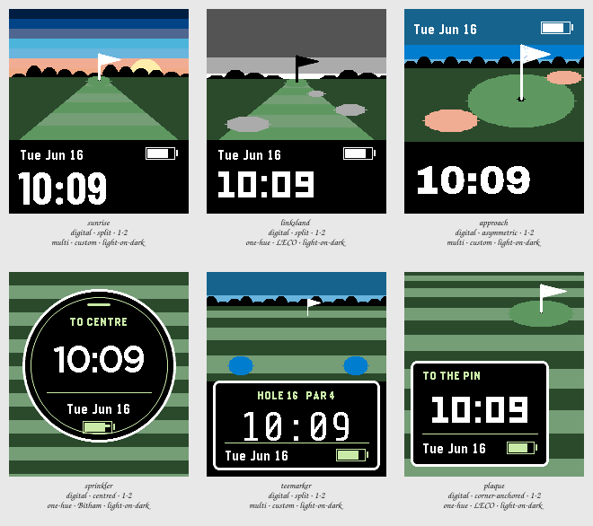

# Session 2026-07-25-golf — Batch 2

## Findings

Only failures and flags appear here. A Variant with nothing against it measured clean.

**Not viable as they stand:** `sunrise`, `linksland`, `approach`, `sprinkler`, `teemarker`, `plaque`.

### sunrise

`digital · split · 1-2 · multi · custom · light-on-dark`

- **contrast** — time element at 2.1:1 against its ground, below the 7.0:1 floor _(at the stress state)_
- **clipping** — something is drawn on the outermost row or column, so it is cut off _(at the stress state)_
- **ink coverage** — 67% of pixels are inked, a dense design _(at the canonical state)_
- **safe margin** — nearest element is 0 px from the display edge, below 8 px _(at the canonical state)_

This is the one that does what was asked: the hole recedes, the sky is graded rather than a flat colour, and the pin stands on the skyline instead of floating on grass. Splitting the display so the scene stops dead at a black band fixed Batch 1's real defect outright — the numerals are now on the highest contrast the display can produce, and the picture above is free to be as busy as it likes. Its weakness is that the fairway is a straight trapezoid: the perspective is convincing but the hole has no shape, and a dogleg would cost nothing.

### linksland

`digital · split · 1-2 · one-hue · LECO · light-on-dark`

- **contrast** — time element at 2.8:1 against its ground, below the 7.0:1 floor _(at the stress state)_
- **clipping** — something is drawn on the outermost row or column, so it is cut off _(at the stress state)_
- **ink coverage** — 67% of pixels are inked, a dense design _(at the canonical state)_
- **safe margin** — nearest element is 0 px from the display edge, below 8 px _(at the canonical state)_

The control, and it loses. Take the sunrise away and the scene stops being a place and becomes a diagram of one — grey ceiling, grey sand, grey dunes, with the only colour left doing all the work. The dune line reads as a notch rather than a horizon where it opens for the fairway, and the black pin against a pale sky is the wrong way round. Useful evidence, not a candidate: the palette was carrying more of sunrise than it looked like.

### approach

`digital · asymmetric · 1-2 · multi · custom · light-on-dark`

- **contrast** — time element at 2.1:1 against its ground, below the 7.0:1 floor _(at the stress state)_
- **clipping** — something is drawn on the outermost row or column, so it is cut off _(at the stress state)_
- **ink coverage** — 66% of pixels are inked, a dense design _(at the canonical state)_
- **safe margin** — nearest element is 0 px from the display edge, below 8 px _(at the canonical state)_

Moving the viewer instead of the weather turns out to be the bigger change. One green filling the frame is a stronger image than a corridor, the off-centre mass genuinely earns the asymmetry, and putting the date and battery up on the sky keeps the foreground band for the time alone. Two problems, both fixable: the treeline merges into the turf so the horizon vanishes, and the bunkers read as pink rather than sand — that colour is the weakest thing on the sheet.

### sprinkler

`digital · centred · 1-2 · one-hue · Bitham · light-on-dark`

- **contrast** — time element at 2.1:1 against its ground, below the 7.0:1 floor _(at the stress state)_
- **clipping** — something is drawn on the outermost row or column, so it is cut off _(at the stress state)_
- **ink coverage** — 60% of pixels are inked, a dense design _(at the canonical state)_
- **safe margin** — nearest element is 0 px from the display edge, below 8 px _(at the canonical state)_

The cleanest Variant in either Batch. One disc, one ring, everything in the middle of it, and the theme costs the layout nothing because a sprinkler head is already a circle around a number. It is also the most likely to be mistaken for a generic round watchface on a green background — there is no horizon, no pin, nothing that says golf to anyone who has not stood over one of these. Beautiful, and the least golf of the six.

### teemarker

`digital · split · 1-2 · multi · custom · light-on-dark`

- **contrast** — time element at 2.1:1 against its ground, below the 7.0:1 floor _(at the stress state)_
- **clipping** — something is drawn on the outermost row or column, so it is cut off _(at the stress state)_
- **ink coverage** — 59% of pixels are inked, a dense design _(at the canonical state)_
- **safe margin** — nearest element is 0 px from the display edge, below 8 px _(at the canonical state)_

The plaque grew to full width and lost the corner-anchoring that made yardage work; the panel now sits like a caption bar under a photograph rather than an object in the scene. The tee markers are two blue blobs at this size and read as neither markers nor anything else, and the turf above them is too shallow for the perspective to show. Weakest of the signage family — the extra width bought a wider time and gave up the composition.

### plaque

`digital · corner-anchored · 1-2 · one-hue · LECO · light-on-dark`

- **contrast** — time element at 6.8:1 against its ground, below the 7.0:1 floor _(at the stress state)_
- **clipping** — something is drawn on the outermost row or column, so it is cut off _(at the stress state)_
- **ink coverage** — 70% of pixels are inked, a dense design _(at the canonical state)_
- **safe margin** — nearest element is 0 px from the display edge, below 8 px _(at the canonical state)_

The straight refinement, and it holds up: same plate, same LECO numerals, but the deepening stripes and the small distant green turn the background from texture into distance. It is the most conservative thing here and still probably the most wearable — the plate hands the time a hard black rectangle, so nothing in the scene can ever threaten it. Sitting next to sunrise it looks careful rather than exciting, which is the honest trade.
