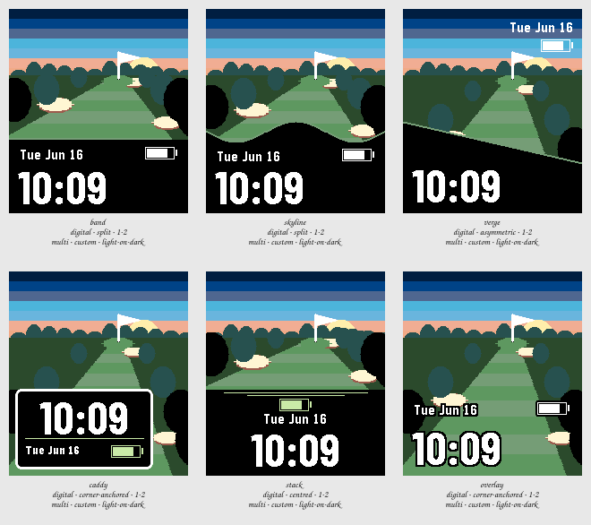

# Session 2026-07-25-golf — Batch 3

## Findings

Only failures and flags appear here. A Variant with nothing against it measured clean.

**Not viable as they stand:** `band`, `skyline`, `verge`, `caddy`, `stack`, `overlay`.

### band

`digital · split · 1-2 · multi · custom · light-on-dark`

- **contrast** — time element at 6.1:1 against its ground, below the 7.0:1 floor _(at the stress state)_
- **clipping** — something is drawn on the outermost row or column, so it is cut off _(at the stress state)_
- **ink coverage** — 65% of pixels are inked, a dense design _(at the canonical state)_
- **safe margin** — nearest element is 0 px from the display edge, below 8 px _(at the canonical state)_

The control, and now that there is something to compare it against the complaint is easy to name: the rule is perfectly horizontal in a picture that has no other horizontal in it, so the eye reads a photograph with a caption bar rather than a place. It is also still the most legible thing here and the easiest to build. Keep it as the floor, not as the answer.

### skyline

`digital · split · 1-2 · multi · custom · light-on-dark`

- **contrast** — time element at 2.4:1 against its ground, below the 7.0:1 floor _(at the stress state)_
- **clipping** — something is drawn on the outermost row or column, so it is cut off _(at the stress state)_
- **ink coverage** — 62% of pixels are inked, a dense design _(at the canonical state)_
- **safe margin** — nearest element is 0 px from the display edge, below 8 px _(at the canonical state)_

The cheapest fix and very nearly the best one. Giving the black edge an undulating crest with a line of light along it turns the same bar into near rough you are standing behind, and it costs one function and no legibility at all. The swell is currently centred, so the crown of the mound sits exactly where the fairway comes toward you and hides its widest part — pushing the high point off to one side would cost nothing and fix the only thing wrong with it.

### verge

`digital · asymmetric · 1-2 · multi · custom · light-on-dark`

- **contrast** — time element at 2.1:1 against its ground, below the 7.0:1 floor _(at the stress state)_
- **clipping** — something is drawn on the outermost row or column, so it is cut off _(at the stress state)_
- **ink coverage** — 68% of pixels are inked, a dense design _(at the canonical state)_
- **safe margin** — nearest element is 0 px from the display edge, below 8 px _(at the canonical state)_

The most confident image in the Sweep: cutting the foreground on a slant lets the hole run past the numerals and off the bottom-right corner, so the scene never actually ends. It has the Batch's one real measured defect — the battery sits on the bright band of the sky at 2.4:1 and effectively disappears, which the date just above it does not, so the fix is to move it rather than to redesign anything. Worth another look with the complications relocated.

### caddy

`digital · corner-anchored · 1-2 · multi · custom · light-on-dark`

- **contrast** — time element at 2.1:1 against its ground, below the 7.0:1 floor _(at the stress state)_
- **clipping** — something is drawn on the outermost row or column, so it is cut off _(at the stress state)_
- **ink coverage** — 74% of pixels are inked, a dense design _(at the canonical state)_
- **safe margin** — nearest element is 0 px from the display edge, below 8 px _(at the canonical state)_

The answer for the yardage sign: the plate stops being a green rectangle with a plate on it and becomes an object standing in a hole. It also shows what the plate costs — it is opaque, it is planted in the middle of the fairway, and at this size it hides more of the course than the sign is worth. The time sits high in the plate with the date crowded under the rule; that is a spacing problem, not a concept problem.

### stack

`digital · centred · 1-2 · multi · custom · light-on-dark`

- **contrast** — time element at 2.4:1 against its ground, below the 7.0:1 floor _(at the stress state)_
- **clipping** — something is drawn on the outermost row or column, so it is cut off _(at the stress state)_
- **ink coverage** — 59% of pixels are inked, a dense design _(at the canonical state)_
- **safe margin** — nearest element is 0 px from the display edge, below 8 px _(at the canonical state)_

Tests whether the complaint was alignment rather than the edge, and answers no. Centring everything makes the split more symmetrical and more inert, the twin accent rules read as a stray artefact rather than a device, and putting the battery above the date inverts the order of importance for no gain. Least interesting Variant in the Session.

### overlay

`digital · corner-anchored · 1-2 · multi · custom · light-on-dark`

- **contrast** — time element at 2.9:1 against its ground, below the 7.0:1 floor _(at the stress state)_
- **clipping** — something is drawn on the outermost row or column, so it is cut off _(at the stress state)_
- **ink coverage** — 80% of pixels are inked, a dense design _(at the canonical state)_
- **safe margin** — nearest element is 0 px from the display edge, below 8 px _(at the canonical state)_

Braver than it has any right to be and it survives — a heavy black keyline holds the numerals against the fairway with no panel at all, and the course is the only thing on the display. Two things give it away: the battery needs a black slab behind it that reads as a hole punched in the picture, and with the type sitting over the widest part of the fairway the busiest area of the scene is exactly where the eye has to work. It is the most golf and the least watch of the six.
