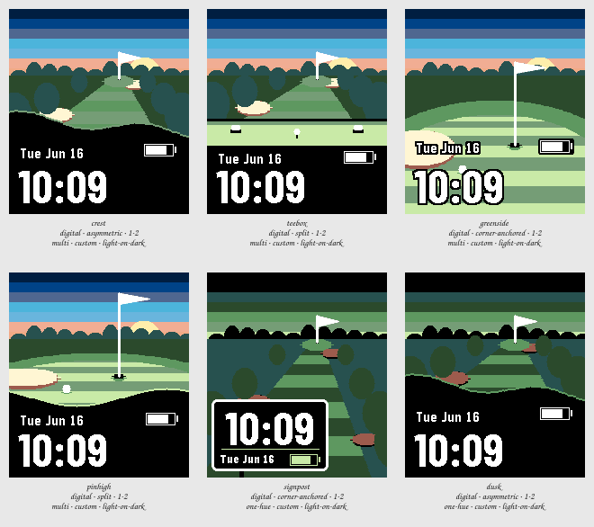

# Session 2026-07-25-golf — Batch 4

## Findings

Only failures and flags appear here. A Variant with nothing against it measured clean.

**Not viable as they stand:** `crest`, `teebox`, `greenside`, `pinhigh`, `signpost`, `dusk`.

### crest

`digital · asymmetric · 1-2 · multi · custom · light-on-dark`

- **contrast** — time element at 2.4:1 against its ground, below the 7.0:1 floor _(at the stress state)_
- **clipping** — something is drawn on the outermost row or column, so it is cut off _(at the stress state)_
- **ink coverage** — 62% of pixels are inked, a dense design _(at the canonical state)_
- **safe margin** — nearest element is 0 px from the display edge, below 8 px _(at the canonical state)_

Merging skyline's undulating edge with verge's slant over-corrects: the mound crowns high enough to bury the near half of the fairway, so the hole is a strip behind a black hill rather than something running toward you. The tilt that made verge work is barely visible under the wave, which means the two devices are fighting rather than combining. Lower the crest by fifteen rows and drop the swell to four and this is probably still the right answer — it is not one at this amplitude.

### teebox

`digital · split · 1-2 · multi · custom · light-on-dark`

- **contrast** — time element at 2.4:1 against its ground, below the 7.0:1 floor _(at the stress state)_
- **clipping** — something is drawn on the outermost row or column, so it is cut off _(at the stress state)_
- **ink coverage** — 71% of pixels are inked, a dense design _(at the canonical state)_
- **safe margin** — nearest element is 0 px from the display edge, below 8 px _(at the canonical state)_

The tee deck does what nothing before it managed, which is put the viewer somewhere: the markers and the ball give the display a scale, and the split stops being asserted because the black now starts where the deck ends. It is the only Variant in the Session whose straight edge is justified by the picture. The deck is too shallow to carry that weight — twenty-seven rows reads as a stripe, and it wants half again as much and a marker large enough to see.

### greenside

`digital · corner-anchored · 1-2 · multi · custom · light-on-dark`

- **clipping** — something is drawn on the outermost row or column, so it is cut off _(at the stress state)_
- **ink coverage** — 84% of pixels are inked, a dense design _(at the canonical state)_
- **safe margin** — nearest element is 0 px from the display edge, below 8 px _(at the canonical state)_

The best golf image in the Session and the worst watch. The pin at full height with the cup, the ball and the bunker legible is the shot the brief was reaching for, but the numerals measure 3.1:1 against the putting surface and only survive because of the keyline — that is the technique carrying the design rather than the design working. The date lands on the bunker, which is the one place on the display where a white keyline would have been better than a black one.

### pinhigh

`digital · split · 1-2 · multi · custom · light-on-dark`

- **contrast** — time element at 2.1:1 against its ground, below the 7.0:1 floor _(at the stress state)_
- **clipping** — something is drawn on the outermost row or column, so it is cut off _(at the stress state)_
- **ink coverage** — 67% of pixels are inked, a dense design _(at the canonical state)_
- **safe margin** — nearest element is 0 px from the display edge, below 8 px _(at the canonical state)_

The strongest Variant in the Batch: the same green as greenside with a ground for the type to stand on, and 21:1 instead of 3.1:1 for the cost of forty rows of picture. Holding the crest level was the right call — a rolled fringe reads as the near edge of a green, where crest's mound reads as a spoil heap. Nothing here needs an argument made for it, which is not true of anything else on the sheet.

### signpost

`digital · corner-anchored · 1-2 · one-hue · custom · light-on-dark`

- **contrast** — time element at 2.4:1 against its ground, below the 7.0:1 floor _(at the stress state)_
- **clipping** — something is drawn on the outermost row or column, so it is cut off _(at the stress state)_
- **ink coverage** — 72% of pixels are inked, a dense design _(at the canonical state)_
- **safe margin** — nearest element is 0 px from the display edge, below 8 px _(at the canonical state)_

caddy's plate at the size it should always have been: cut down until it reads as something staked in the ground, moved off the fairway, and given a post so it is standing rather than floating. The sign is now the brightest thing on a dark hole, which is exactly how a real yardage marker behaves at that hour. The dusk bunkers are a genuine defect — brown sand under a green sky reads as mud, not as a hazard.

### dusk

`digital · asymmetric · 1-2 · one-hue · custom · light-on-dark`

- **contrast** — time element at 2.1:1 against its ground, below the 7.0:1 floor _(at the stress state)_
- **clipping** — something is drawn on the outermost row or column, so it is cut off _(at the stress state)_
- **ink coverage** — 49% of pixels are inked, a dense design _(at the canonical state)_
- **safe margin** — nearest element is 0 px from the display edge, below 8 px _(at the canonical state)_

Worth running and not worth keeping, which is what a control is for: identical geometry to crest with only the light changed, and it answers the question honestly. Draining the sky costs more than expected — the seven-band sunrise was carrying a real share of the appeal, and without it the hole is competent and flat. The one thing to take from it is that the scene still reads as a golf hole in near-monochrome, so the drawing is sound even where the palette is doing the selling.

## Pick

**pinhigh**

Picked with teebox — both go forward. pinhigh: the green from a few paces off, pin at full height, cup, ball and greenside bunker, with a level rolled fringe giving the numerals a black ground at 21:1. teebox: the same hole from the tee deck, the only Variant in the Session whose straight split edge is justified by the picture. Batch 4 of four; the Session ran Spread, Sweep on composition, then this Spread on composition x hue.

Session closed.
