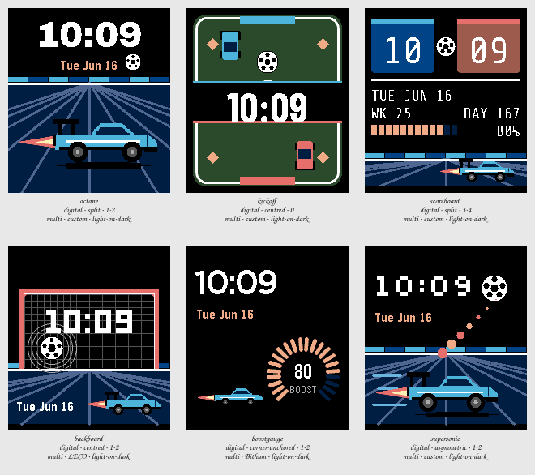

# Session 2026-07-25-rocket-league — Batch 1

## Findings

Only failures and flags appear here. A Variant with nothing against it measured clean.

**Not viable as they stand:** `octane`, `kickoff`, `scoreboard`, `backboard`, `boostgauge`, `supersonic`.

### octane

`digital · split · 1-2 · multi · custom · light-on-dark`

- **contrast** — time element at 1.3:1 against its ground, below the 7.0:1 floor _(at the stress state)_
- **clipping** — something is drawn on the outermost row or column, so it is cut off _(at the stress state)_
- **ink coverage** — 59% of pixels are inked, a dense design _(at the canonical state)_
- **safe margin** — nearest element is 0 px from the display edge, below 8 px _(at the canonical state)_

### kickoff

`digital · centred · 0 · multi · custom · light-on-dark`

- **contrast** — time element at 2.1:1 against its ground, below the 7.0:1 floor _(at the stress state)_
- **clipping** — something is drawn on the outermost row or column, so it is cut off _(at the stress state)_
- **ink coverage** — 48% of pixels are inked, a dense design _(at the canonical state)_
- **safe margin** — nearest element is 0 px from the display edge, below 8 px _(at the canonical state)_

### scoreboard

`digital · split · 3-4 · multi · custom · light-on-dark`

- **contrast** — time element at 2.2:1 against its ground, below the 7.0:1 floor _(at the stress state)_
- **contrast** — complication element at 1.3:1 against its ground, below the 4.5:1 floor _(at the stress state)_
- **contrast** — complication element at 1.3:1 against its ground, below the 4.5:1 floor _(at the stress state)_
- **clipping** — something is drawn on the outermost row or column, so it is cut off _(at the stress state)_
- **ink coverage** — 44% of pixels are inked, a dense design _(at the canonical state)_
- **safe margin** — nearest element is 0 px from the display edge, below 8 px _(at the canonical state)_

### backboard

`digital · centred · 1-2 · multi · LECO · light-on-dark`

- **contrast** — time element at 1.3:1 against its ground, below the 7.0:1 floor _(at the stress state)_
- **clipping** — something is drawn on the outermost row or column, so it is cut off _(at the stress state)_
- **ink coverage** — 46% of pixels are inked, a dense design _(at the canonical state)_
- **safe margin** — nearest element is 0 px from the display edge, below 8 px _(at the canonical state)_

### boostgauge

`digital · corner-anchored · 1-2 · multi · Bitham · light-on-dark`

- **contrast** — time element at 1.3:1 against its ground, below the 7.0:1 floor _(at the stress state)_
- **contrast** — complication element at 1.3:1 against its ground, below the 4.5:1 floor _(at the stress state)_

### supersonic

`digital · asymmetric · 1-2 · multi · custom · light-on-dark`

- **contrast** — time element at 1.3:1 against its ground, below the 7.0:1 floor _(at the stress state)_
- **clipping** — something is drawn on the outermost row or column, so it is cut off _(at the stress state)_
- **ink coverage** — 42% of pixels are inked, a dense design _(at the canonical state)_
- **safe margin** — nearest element is 0 px from the display edge, below 8 px _(at the canonical state)_
