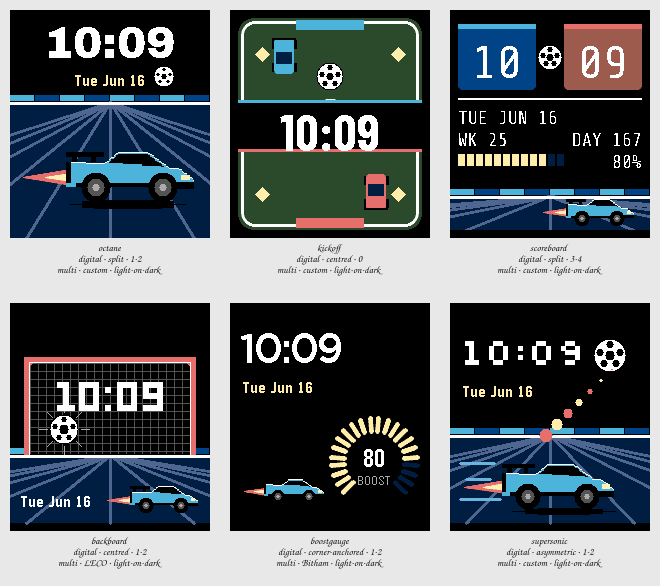

# Session 2026-07-25-rocket-league — Batch 2

## Findings

Only failures and flags appear here. A Variant with nothing against it measured clean.

**Not viable as they stand:** `octane`, `kickoff`, `scoreboard`, `backboard`, `boostgauge`, `supersonic`.

### octane

`digital · split · 1-2 · multi · custom · light-on-dark`

- **contrast** — time element at 1.3:1 against its ground, below the 7.0:1 floor _(at the stress state)_
- **clipping** — something is drawn on the outermost row or column, so it is cut off _(at the stress state)_
- **ink coverage** — 61% of pixels are inked, a dense design _(at the canonical state)_
- **safe margin** — nearest element is 0 px from the display edge, below 8 px _(at the canonical state)_

The brief's literal reading, and it works: at this size the wedge, the wing and the big wheels are unmistakably a battle-car, and giving the type its own black half means the picture costs the time nothing. It is also the only tile that is purely a poster — the scene carries no information at all, so everything below the horizon is decoration. The ball crowds the date badly at the Stress state, and supersonic is this same idea with a composition.

### kickoff

`digital · centred · 0 · multi · custom · light-on-dark`

- **contrast** — time element at 2.1:1 against its ground, below the 7.0:1 floor _(at the stress state)_
- **clipping** — something is drawn on the outermost row or column, so it is cut off _(at the stress state)_
- **ink coverage** — 48% of pixels are inked, a dense design _(at the canonical state)_
- **safe margin** — nearest element is 0 px from the display edge, below 8 px _(at the canonical state)_

The fastest theme read in the Batch: nobody who has played needs telling what this is, and it gets there without drawing a car in profile. The halfway band is the problem and it is structural, not cosmetic — it is a black panel laid over the pitch, and what it covers is the centre circle, the best thing on the drawing. With zero complications this is also the least useful face here, and the two top-down cars are shapes rather than Octanes.

### scoreboard

`digital · split · 3-4 · multi · custom · light-on-dark`

- **contrast** — time element at 2.2:1 against its ground, below the 7.0:1 floor _(at the stress state)_
- **contrast** — complication element at 1.3:1 against its ground, below the 4.5:1 floor _(at the stress state)_
- **contrast** — complication element at 1.3:1 against its ground, below the 4.5:1 floor _(at the stress state)_
- **clipping** — something is drawn on the outermost row or column, so it is cut off _(at the stress state)_
- **ink coverage** — 44% of pixels are inked, a dense design _(at the canonical state)_
- **safe margin** — nearest element is 0 px from the display edge, below 8 px _(at the canonical state)_

The one idea in this Batch that could not be moved to another theme: the hour and the minute are not shown on a scoreboard, they are the score. The HUD half earns its space too — four live fields, all clock- or battery-derived, so all four move under the Stress state. Emery washes the warm end of the palette out badly enough that the orange plate lands as salmon, so the tile currently reads blue versus pink, which is the one thing this design cannot afford.

### backboard

`digital · centred · 1-2 · multi · LECO · light-on-dark`

- **contrast** — time element at 1.3:1 against its ground, below the 7.0:1 floor _(at the stress state)_
- **clipping** — something is drawn on the outermost row or column, so it is cut off _(at the stress state)_
- **ink coverage** — 45% of pixels are inked, a dense design _(at the canonical state)_
- **safe margin** — nearest element is 0 px from the display edge, below 8 px _(at the canonical state)_

The only Variant where the theme hands the type contrast instead of taking it — the net is black, so the numerals sit on the best ground in the Batch, and that is the opposite trade from every other tile here. The goal mouth, the ball in the net and the scorer driving out are a complete sentence in one frame. The risk is that it is a frame: a moment that never changes stops being a moment, and in a week this is a picture of a goal rather than a goal.

### boostgauge

`digital · corner-anchored · 1-2 · multi · Bitham · light-on-dark`

- **contrast** — time element at 1.3:1 against its ground, below the 7.0:1 floor _(at the stress state)_
- **contrast** — complication element at 1.3:1 against its ground, below the 4.5:1 floor _(at the stress state)_

The only tile where the theme does work rather than decoration, because the game's boost meter already is a battery gauge — the borrowing is functional and the ring is the one complication anyone would actually read. It is also the calmest thing here and the only one with clean glance hierarchy: the eye lands on the time, then the gauge, and there is nothing else. The cost is fan service — a stranger sees a well-made instrument and no Rocket League at all.

### supersonic

`digital · asymmetric · 1-2 · multi · custom · light-on-dark`

- **contrast** — time element at 1.3:1 against its ground, below the 7.0:1 floor _(at the stress state)_
- **clipping** — something is drawn on the outermost row or column, so it is cut off _(at the stress state)_
- **ink coverage** — 41% of pixels are inked, a dense design _(at the canonical state)_
- **safe margin** — nearest element is 0 px from the display edge, below 8 px _(at the canonical state)_

Best composition in the Batch by a distance: the diagonal from the car through the boost trail to the ball throws the weight off both axes, and the corner it leaves empty is exactly where the type goes, so nothing is ever fought over. The pixel face is the right call for a tile trying to be arcade rather than photographic. Its problem is octane — this is that Variant with movement added, and if this one works there is no reason to keep the other.
