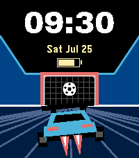

# goalmouth

A Rocket League watchface: the stadium looking down the pitch at the goal, with
a Fennec on the deck between you and it.



Standard information only — time, date, battery.

## Why the scene stops at the horizon

A Rocket League arena is saturated blue almost everywhere, and white type set
straight on it measures around 2:1 against a 7:1 floor. The scene therefore ends
at the horizon and the top third of the display stays black, which costs a third
of the picture and buys 21:1 without a panel appearing anywhere.

The depth comes from one decision: the goal is drawn *smaller* than the car. Two
objects of known size with the nearer one bigger is the whole trick, and it is
why the goal must not be enlarged to fill the space above it. An earlier design
in the same session drew the goal wide so the numerals could sit inside its
mouth, and lost the distance entirely.

Its sibling [liftoff](../liftoff) is the same arena with the car off the deck,
and the two share the scene.

## Design provenance

Selected from Studio session `2026-07-25-fennec-aerial`, batch 4. The Variant it
came from is at `studio/src/c/variants/goalmouth.c`, and the contact sheet it was
picked off is at
`studio/sessions/2026-07-25-fennec-aerial/batch-4/contact-sheet.png`. Nothing was
carried across as code — the Studio Variant is disposable evidence, and this is a
separate implementation on top of `shared/`.

## Building & running

```sh
pebble build
pebble install --emulator emery
```

## Layout

```
src/c/main.c                    entry point
src/c/windows/main_window.c     the wiring
```

The arena and the time-over-date block are shared components; the transform and
polygon maths behind the car is in `shared/c/rocket_geometry.c` and tested on the
host by `shared/tests/test_rocket_geometry.c`.

## Fonts

The time is set in Archivo Black, subset to `[0-9: APM]`; the date and the
battery take Pebble system faces. Archivo Black is SIL Open Font License 1.1 and
ships inside the `.pbw`, so its licence file travels with it — see
[shared/resources/fonts](../../shared/resources/fonts) for what that obliges.
