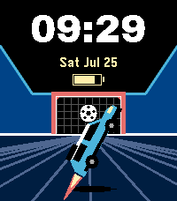

# liftoff

A Rocket League watchface: the same stadium as [goalmouth](../goalmouth), with
the Fennec off the deck and its nose to the sky.



Standard information only — time, date, battery.

## Why the car is in profile when the arena is not

Seen from directly behind, a car pointing at the sky looks identical to one
pointing at the goal. There is no silhouette change to carry the pitch, and
foreshortening the rear view to compensate reads as a car skimming the floor
rather than leaving it — which is what the first attempt at this face did.

So the arena still faces down the pitch and the car is turned side-on and rotated
sixty degrees. The two vantages disagree, deliberately: the choice is between a
car that is clearly climbing and a camera that is consistent, and this face takes
the climb. The shadow left behind on the floor is the other half of it — it is
the only thing in the frame saying the car and the ground are no longer in the
same place.

Everything else is goalmouth: the same split, the same black upper third for the
type, the same reasons.

## Design provenance

Selected from Studio session `2026-07-25-fennec-aerial`, batch 4. The Variant it
came from is at `studio/src/c/variants/liftoff.c`, and the contact sheet it was
picked off is at
`studio/sessions/2026-07-25-fennec-aerial/batch-4/contact-sheet.png`. Nothing was
carried across as code — the Studio Variant is disposable evidence, and this is a
separate implementation on top of `shared/`.

## Building & running

```sh
pebble build
pebble install --emulator emery
```

## Layout

```
src/c/main.c                    entry point
src/c/windows/main_window.c     the wiring
```

The arena and the time-over-date block are shared components; the transform and
polygon maths behind the car is in `shared/c/rocket_geometry.c` and tested on the
host by `shared/tests/test_rocket_geometry.c`.

## Fonts

The time is set in Archivo Black, subset to `[0-9: APM]`; the date and the
battery take Pebble system faces. Archivo Black is SIL Open Font License 1.1 and
ships inside the `.pbw`, so its licence file travels with it — see
[shared/resources/fonts](../../shared/resources/fonts) for what that obliges.
