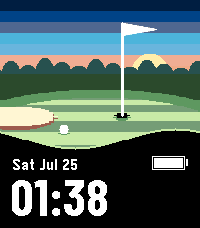

# pinhigh

A golf watchface: the green seen from a few paces off it, with the near fringe
rolling across the bottom of the display as a black ground for the time.



Standard information only — time, date, battery.

## Why the fringe

A golf scene is mid-green almost everywhere, and white type set straight on it
measures around 3:1 against a 7:1 floor. Cutting a black foreground out of the
picture takes the numerals to 21:1 without a panel appearing anywhere on the
display. Rolling that edge rather than ruling it is what keeps it reading as the
near edge of a green rather than as a caption bar under a photograph.

Its sibling [teebox](../teebox) answers the same problem from the other end of
the hole, and the two share the scene.

## Design provenance

Selected from Studio session `2026-07-25-golf`, batch 4. The Variant it came
from is at `studio/src/c/variants/pinhigh.c`, and the contact sheet it was picked
off is at `studio/sessions/2026-07-25-golf/batch-4/contact-sheet.png`. Nothing
was carried across as code — the Studio Variant is disposable evidence, and this
is a separate implementation on top of `shared/`.

## Building & running

```sh
pebble build
pebble install --emulator emery
```

## Layout

```
src/c/main.c                    entry point
src/c/windows/main_window.c     the fringe, and the wiring
```

The scene, the battery cell and the date-over-time block are shared components;
the perspective maths is in `shared/c/golf_perspective.c` and tested on the host
by `shared/tests/test_golf_perspective.c`.
