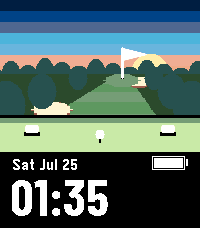

# teebox

A golf watchface: the hole seen from the tee, with the tee deck underfoot and
the time on the black below it.



Standard information only — time, date, battery.

## Why the straight edge

A horizontal rule across a scene watchface normally reads as a caption bar under
a photograph, which is the usual reason not to use one. It works here because the
black does not begin at an arbitrary row — it begins where the tee deck stops.
The front lip of a tee reads as somewhere to stand.

That makes `GROUND` in `main_window.c` not a free parameter: it is the front of
the deck, and moving it moves the wearer.

Its sibling [pinhigh](../pinhigh) answers the same problem from the other end of
the hole, and the two share the scene.

## Design provenance

Selected from Studio session `2026-07-25-golf`, batch 4. The Variant it came from
is at `studio/src/c/variants/teebox.c`, and the contact sheet it was picked off
is at `studio/sessions/2026-07-25-golf/batch-4/contact-sheet.png`. Nothing was
carried across as code — the Studio Variant is disposable evidence, and this is a
separate implementation on top of `shared/`.

## Building & running

```sh
pebble build
pebble install --emulator emery
```

## Layout

```
src/c/main.c                    entry point
src/c/windows/main_window.c     the foreground, and the wiring
```

The scene, the battery cell and the date-over-time block are shared components;
the perspective maths is in `shared/c/golf_perspective.c` and tested on the host
by `shared/tests/test_golf_perspective.c`.
